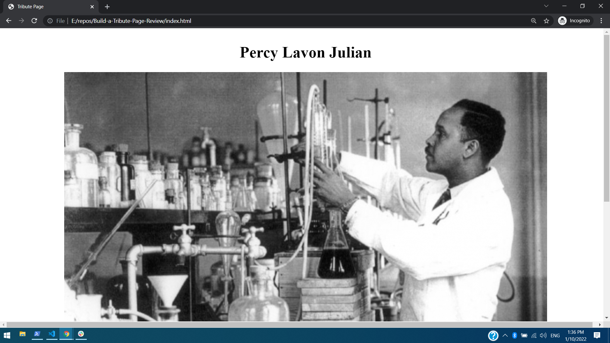

# Build a Tribute Page
### (Review of previous work)

> This page is a presenting sone informaton about Percy Lavon Julian; an American research chemist and a pioneer in the chemical synthesis of medicinal drugs from plants.

## Built With

- HTML and CSS

## Live Demo

[Live Demo Link](https://elerqsousy.github.io/Build-a-Tribute-Page-Review/)

## Authors

👤 **Mahmoud Rizk**

- GitHub: [@Elerqsousy](https://github.com/Elerqsousy)
- LinkedIn: [Mahmoud El Erqsousy](https://www.linkedin.com/in/mahmoud-rizk/)

👤 **Author2**

- GitHub: [@kendoriddy](https://github.com/kendoriddy)

## 🤝 Contributing

Contributions, issues, and feature requests are welcome!

## Show your support

Give a ⭐️ if you like this project!

## Acknowledgments

- This project was built in collaboration with @kendoriddy

## 📝 License

This project is [MIT](./MIT.md) licensed.